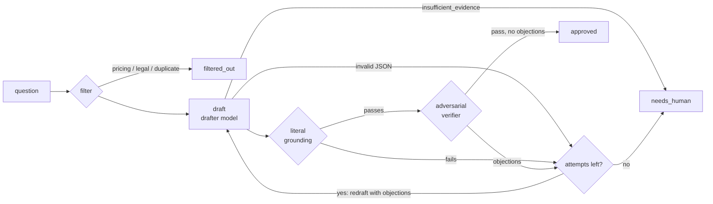

# grounded-agents

[](https://github.com/Tyran-byte/grounded-agents/actions/workflows/ci.yml)

A small, runnable agent pipeline that drafts answers and **only ships claims it can cite**.
Staged workers — deterministic filter → draft → literal grounding check → adversarial
verifier → one retry with the objections → hand to a human — run under a manifest with an
autonomy tier and spend caps, behind a sealed eval gate, and every run lands in a JSONL ledger
with a trace id.

The pipeline is built **twice**: once in plain Python (standard library only) and once with
**LangGraph + Pydantic**. Both engines call the same controls and pass the same sealed evals,
so the comparison shows what a framework adds and what it does not.

The mechanics come from a private multi-stage LLM pipeline that has been running unattended
on a self-hosted machine since September 2026. The domain here is invented: **Quillmere**, a
fictional analytics SaaS company that has to answer its enterprise customers' security
questionnaires without promising anything its control documents do not say.

```
$ grounded run workers/answer-plain.toml --provider fake --script examples/fake-script.json
answer-plain [plain, T1, dry] trace=answer-plain-20261004T050157-3624
  q01      approved      attempts=1
  q02      approved      attempts=1
  q03      approved      attempts=2
  q04      needs_human   attempts=2  (failed 2 attempts: drops-condition)
  q05      needs_human   attempts=1  (insufficient_evidence)
  q06      filtered_out  attempts=0  (pricing)
  q07      approved      attempts=2
  q08      approved      attempts=1
  would write 5 row(s) to out/answers/answer-plain-20261004T050157-3624.jsonl
  would write 2 row(s) to out/review-queue/answer-plain-20261004T050157-3624.jsonl
  calls=18 cost_usd=0.043528 exit=0
```

## Why these controls

A security questionnaire answer becomes a contractual commitment. "We encrypt everything with
AES-256 and guarantee a 12-hour recovery" is a liability if the documents say the recovery time
is an *internal target*. Each control below exists because of a specific way LLM drafts go
wrong:

| Failure | Control | Where |
|---|---|---|
| The model answers what no one should answer automatically (pricing, liability) | Deterministic intake filter, before any spend | `core/filters.py` |
| The draft invents or paraphrases a source | Every claim quotes its source **verbatim**; the quote must exist in that exact section. Only whitespace and typographic quotes/dashes are normalised — no case folding, no fuzzy match | `core/grounding.py` |
| The prose says more than the cited claims ("24/7", "99.9%") | Every figure in the answer or a claim must appear in a cited quote | `core/grounding.py` |
| The quote is real but the claim stretches it (drops a plan tier, turns a target into a guarantee, omits a section that qualifies it) | Adversarial verifier on a stronger model reads the cited sections and every other section | `prompts/verifier.md`, `core/steps.py` |
| The verifier itself hallucinates an objection | Its objections are grounding-checked too; an unverifiable one **still blocks** — doubt goes to a human, never to shipping | `core/grounding.py` |
| Endless retry loops that burn money | Exactly one retry, fed with the objections; then `needs_human` with both drafts and every objection | `core/steps.py` |
| "We don't know" treated as a failure | `insufficient_evidence` is a valid outcome and goes straight to a human, without a retry | `core/steps.py` |
| A runaway run | Caps per call, per run and per day, checked **before** each call; today's spend comes from the ledger | `core/budget.py` |
| A worker doing more than it should | Autonomy tiers enforced by the runtime; dry-run by default; writes only to declared paths | `runtime/` |
| A prompt tweak (or a policy edit) that quietly breaks things | A frozen eval set and a seal bound to the hash of the code, prompts and control documents; `--apply` refuses to run without a green, current seal | `evals/` |
| Nobody notices a broken nightly job, or everyone gets paged hourly | Alerts only on a change of state (ok → failing → recovered) | `runtime/alerts.py` |

## Flow



The grounding check runs before the verifier because it is free and exact: a draft that fails
it never reaches the expensive model.

## Quickstart (offline, no API key)

```bash
python -m venv .venv && . .venv/bin/activate
pip install -e '.[dev,langgraph]'      # or '.[dev]' for the plain engine only
pytest                                  # no network, no key
examples/run_offline.sh                 # both engines, evals, apply, ledger
```

The fake provider replays scripted model responses — hand-written, not captured from a real
model — from `examples/fake-script.json`, so every
control — filter, grounding, verifier, retry, budget, seal, ledger — runs for real while the
"model" is deterministic. The example questionnaire covers all four outcomes: shipped on the
first try (q01), fixed on the single retry after a grounding failure (q03) or a verifier
objection (q07), escalated to a human (q04, q05) and filtered out (q06).

## Two engines, one set of controls

| | plain | LangGraph + Pydantic |
|---|---|---|
| Engine code (non-blank lines) | 15 + 36 shared | 131 (graph + Pydantic models) |
| Third-party packages installed | 0 | 38 |
| Output validation | hand-written parsers, errors as JSON paths | Pydantic models, errors reported as JSON paths; a test checks both parsers accept and reject the same fixtures |
| Conformance scenarios (`tests/scenarios.py`) | 7 / 7 | 7 / 7 |
| Sealed eval set, fake provider | 24 / 24 green | 24 / 24 green |
| Routing | a `while` loop | an explicit `StateGraph` with conditional edges |

Both engines call the same step functions in `core/steps.py`; an engine only decides the order.
That is a design rule, not a coincidence: only `step_verify` can approve an item, and it refuses
a draft that did not pass grounding in the same attempt, so no engine can skip a control.

What LangGraph buys here: the routing is declared and inspectable (`build_graph(ctx).get_graph()`
can render it as Mermaid), and the graph plugs into its ecosystem — checkpointing, streaming, tracing,
human-in-the-loop interrupts — when a pipeline needs them. What it does not buy: any of the
controls. Grounding, budgets, tiers, the retry policy and the eval seal are the same code in
both engines; the framework sits on top of them, not instead of them. For a pipeline this
size, the plain engine is simpler to run and to audit; the LangGraph engine starts paying off
once the graph grows branches, parallel work or long-lived checkpoints.

## Running against real models

No model is named anywhere in the code. Each role is configured through the manifest or the
environment:

```bash
pip install -e '.[anthropic]'            # or use any OpenAI-compatible endpoint, no extra needed

export GA_DRAFTER_PROVIDER=anthropic     # anthropic | openai_compat
export GA_DRAFTER_MODEL=<model id>
export GA_DRAFTER_PRICE_IN_PER_MTOK=<USD per million input tokens>
export GA_DRAFTER_PRICE_OUT_PER_MTOK=<USD per million output tokens>

export GA_VERIFIER_PROVIDER=openai_compat
export GA_VERIFIER_MODEL=<model id>
export GA_VERIFIER_BASE_URL=https://<host>/v1
export GA_VERIFIER_API_KEY_ENV=<name of the env var that holds the key>
export GA_VERIFIER_PRICE_IN_PER_MTOK=...
export GA_VERIFIER_PRICE_OUT_PER_MTOK=...

grounded evals seal --engine plain --provider real    # seal with the models you will run
grounded run workers/answer-plain.toml                # dry run
grounded run workers/answer-plain.toml --apply        # writes, if the seal is green
```

Suggested tiers, not names: a fast, inexpensive model for drafting; the strongest model you can
afford for verification; ideally from **different model families**, so the verifier does not
share the drafter's blind spots. Prices are configuration because they change; there are no
defaults, so an unset model fails before any call instead of falling back to whatever a library
happens to choose.

## Runtime

A worker is a TOML manifest (`workers/answer-plain.toml`):

```toml
name = "answer-plain"
engine = "plain"             # or "langgraph"
tier = "T1"                  # proposes: writes answers and a review queue, sends nothing
schedule = "0 7 * * 1-5"     # cron; `grounded schedule` prints crontab lines
timeout_s = 600
inputs = ["data/quillmere/questionnaires"]
writes = ["out/answers", "out/review-queue"]

[budget]
per_call_usd = 0.05
per_run_usd = 0.50
per_day_usd = 2.00
```

| Tier | Meaning | Enforced as |
|---|---|---|
| T0 | notify only | may not write any file |
| T1 | propose | writes only under its declared `writes` paths |
| T2 | act reversibly | T1 rules (no bundled worker acts yet; a T2 action must be declared and undoable) |
| T3 | never alone | `--apply` requires `--approved-by NAME`, recorded in the ledger |

- **Dry-run by default.** Without `--apply` nothing is written except the ledger line.
- **Seal gate.** `--apply` refuses to start unless a green seal matches the current code,
  prompts, engine and models.
- **Ledger.** `ledger/runs.jsonl`, one line per run: worker, engine, tier, trace id, mode,
  start, duration, exit code, cost, calls, item counts by final state, approver, error.
  Output files and review-queue rows carry the same trace id.
- **Alerts.** On change of state only, through a pluggable notifier: stdout by default, or any
  JSON webhook via `GA_ALERT_WEBHOOK`.
- **Exit codes.** `0` ok · `1` red eval gate · `2` could not run (budget, provider, missing or
  stale seal, invalid manifest).

## Sealed evals

```bash
grounded evals freeze                 # hash the case set into evals/SET.lock (once)
grounded evals seal --engine plain    # run the gate, record green/red against the logic hash
grounded evals check --engine plain   # run the gate without sealing
grounded evals sample 5               # five shipped answers with their quotes, for a human read
grounded evals verify --engine plain  # is the committed seal still valid for this code? (CI)
```

- The set (`evals/cases/`) is meant to be written and frozen **before** prompts or logic are
  tuned. Changing it later needs `freeze --new-version`, which bumps the version visibly: the
  set cannot be quietly edited until the pipeline passes. It is at v2: three cases expected
  `needs_human` only because that is what the scripted model did, although the documents do
  answer them. The expectation was fixed, the version records it, and the reason is in
  `evals/set.toml`.
- The seal binds a result to the hash of `core/`, the engine, `prompts/` and the control
  documents, and to the models used. Any change to what decides an answer invalidates it. A red result is sealed as red.
- Hard rules: zero ungrounded claims shipped (re-checked on what actually shipped), zero
  forbidden strings in shipped answers, outcome accuracy at or above the set's threshold.
- The qualitative sample is not optional decoration: reading it is how the figure check above
  was found. A scripted answer stated more than its cited claims; the gate was green; the sample
  showed it.

What the offline seal proves and what it does not: with the fake provider, the evals test the
**mechanics** — that every route, retry and control behaves as specified on scripted model
behaviour. They say nothing about how well a real model drafts. Sealing with `--provider real`
runs the same frozen set against prompts plus models; that seal is separate and only authorises
runs with those same models.

## Layout

```
src/grounded_agents/
  core/        controls shared by both engines: corpus, grounding, schemas, states, filters,
               budget, providers (fake, anthropic, openai_compat), prompts, steps
  engines/     plain/ (a loop) and langgraph/ (a StateGraph + Pydantic models)
  runtime/     manifest, writer (tiers), runner, ledger, alerts, context
  evals/       seal (freeze, hash, verify) and gate (metrics, sample)
  cli.py       the `grounded` command
data/quillmere/  invented control documents and an example questionnaire
evals/           case set, frozen hash, seals, scripted responses for offline runs
prompts/         drafter and verifier system prompts
workers/         one manifest per engine
```

## Limitations

- The corpus is small enough to fit in a prompt, so there is no retrieval step. A larger
  corpus needs retrieval, and retrieval needs its own evals (did the right section come back?).
- Verbatim quoting is strict on purpose. It rejects legitimate rewording; the retry and the
  human queue absorb that cost.
- The figure check compares digit sequences. "Twelve hours" written out in words is not caught
  by it; the verifier is the backstop.
- Scheduling is declared, not run: `grounded schedule` prints crontab lines, and the host
  scheduler runs them.

## License

MIT
